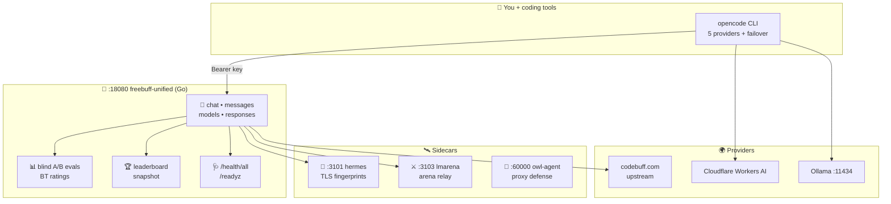

# AI Stack — Local AI Agent Infrastructure


> **One-sentence version (grade-6 plain):** one workstation that serves free
> AI models to all your coding tools through a single front door, judges
> model answers blindly, and heals itself when providers die.

Code words below (`endpoint`, `sidecar`, `passthrough`, `SSE`, `sealed`)
keep exact coding meaning. Sentences stay short so learning never stops.
Live provider facts live in [`provider-status.md`](provider-status.md).

---

## 1. Discovery map



### Port atlas

| Port | Name | Job |
|------|------|-----|
| `:18080` | Gateway | 🟢 **front door** — chat, evals, leaderboard, health |
| `:9091` | Dashboard | 🖥️ control room UI + SSE |
| `:3101` | Hermes | 🥷 stealth TLS fingerprints + SOCKS5 pool |
| `:3103` | LMArena | ⚔️ arena session relay |
| `:60000` | Owl-agent | 🦉 proxy defense, chameleon fingerprints, MCP fetch |
| `:9101` | Owl metrics | 📈 Prometheus (55 proxies) |
| `:11434` | Ollama | 🏠 local models (`qwen2.5:3b` live) |
| `:31000` | AutoClaw | 🤖 GLM gateway (needs Z.ai login) |

---

## 2. Word bank

| Code word | Plain meaning | Example here |
|-----------|---------------|--------------|
| **endpoint** | URL door doing one job | `POST /v1/lmarena/evals` starts a contest |
| **sidecar** | Helper program riding next to main one | Node service on `:3101` |
| **passthrough** | Passing a letter on unopened | `/v1/*` → `:3457` backend |
| **SSE** | Server taps out messages line by line | Streaming answers + 15s heartbeats |
| **sealed** | Hidden until big reveal | Model names in blind evals |
| **Bradley-Terry** | Fairness math turning wins into ratings | `bt_ratings` in scores |
| **failover** | Auto-switch when provider dies | 60s probe daemon |
| **runbook** | Step list for when things break | `scripts/runbooks/` |

---

## 3. Services

| Service | Address | Status | Notes |
|---------|---------|--------|-------|
| Freebuff gateway | `http://localhost:18080` | systemd, active | `/healthz`, `/health/all`, `/readyz`, `/v1/models`, `/v1/chat/completions`, `/proxy/verify` |
| AutoClaw proxy | `http://localhost:31000` | systemd, active | `/health`, `/v1/models`, dashboard UI (needs accounts) |
| Hermes sidecar | `http://localhost:3101` | systemd, active | TLS 1.3 / HTTP2 stealth fetch |
| LMArena sidecar | `http://localhost:3103` | systemd, active | Arena sessions + eval relay |
| Owl-agent | `http://localhost:60000` | systemd, active | `/v1/models`, `/fetch`, `/chameleon/stats`, supervisor-wrapped |
| Stealth proxy (Rust) | `:443` (with domain) | binary built | Auto-ACME TLS, fake-nginx 404, multi-user auth |
| Opencode failover | user unit | active | 60s provider polling, auto-swaps model |
| Owl-watch | user unit | active | 30s drift sync (unified-owl → installs) |

---

## 4. Quickstart

```bash
# 1. Gateway (needs keys in config.yaml — never committed)
git clone https://github.com/marktantongco/unified-freebuff-proxy.git
cd unified-freebuff-proxy
cp config.example.yaml config.yaml   # fill server.api_keys
go build -o bin/freebuff-unified ./cmd/freebuff
./bin/freebuff-unified check
sudo systemctl enable --now freebuff-unified hermes-sidecar lmarena-stealth-proxy

# 2. Verify (all 200)
curl http://127.0.0.1:18080/healthz
curl http://127.0.0.1:18080/readyz
curl http://127.0.0.1:18080/health/all

# 3. Chat once (needs Bearer key from config.yaml)
curl http://127.0.0.1:18080/v1/chat/completions \
  -H "Authorization: Bearer fbu_YOUR_key" -H "Content-Type: application/json" \
  -d '{"model":"mimo/mimo-v2.5","messages":[{"role":"user","content":"Say READY"}]}'

# 4. AutoClaw proxy (needs accounts.txt with email:password lines)
python3 -m venv .venv && .venv/bin/pip install -r requirements.txt
cp proxies.txt.example proxies.txt
sudo systemctl enable --now autoclaw-proxy.service
.venv/bin/python autoclaw_autologin.py --batch accounts.txt --headless --concurrent 3

# 5. Use inside opencode (provider preconfigured)
opencode run --model autoclaw/glm-5-turbo "hello"
```

> [!WARNING]
> `config.yaml` holds real keys and is git-ignored. Never commit it.
> The template is `config.example.yaml` with `fbu_CHANGE_ME_*` placeholders.

---

## 5. Eval harness — judge models fairly

Human battles models by hand in a browser, pastes both outputs, gateway
stores blindly and scores. No automated fetching (ToS-clean by design).

```bash
B=http://127.0.0.1:18080; KEY=Bearer\ fbu_YOUR_key
ID=$(curl -s -X POST -H "Authorization: $KEY" -d '{"name":"friday"}' $B/v1/lmarena/evals \
  | python3 -c "import sys,json;print(json.load(sys.stdin)['eval']['id'])")
curl -s -X POST -H "Authorization: $KEY" -H "Content-Type: application/json" \
  -d '{"prompt":"...","output_a":"...","output_b":"...","model_a":"m1","model_b":"m2"}' \
  $B/v1/lmarena/evals/$ID/rounds        # labels sealed
curl -s -X POST -H "Authorization: $KEY" -d '{"winner":"a"}' \
  $B/v1/lmarena/evals/$ID/rounds/$RID/vote
curl -s -X POST -H "Authorization: $KEY" $B/v1/lmarena/evals/$ID/reveal  # wins + BT ratings
```

Bulk paste: `POST .../import` with `{"format":"jsonl"|"csv","data":"..."}`
(≤500 records, winners optional = pre-voted, atomic).
Public ratings: `GET /v1/lmarena/leaderboard?category=overall&top=5`
(read-only HF dump, cached 24h).

---

## 6. Opencode routing + failover

`~/.config/opencode/opencode.json` holds 5 providers (`owl`, `x3`,
`opencode3` = Cloudflare, `opencode4` = Ollama, `opencode5` = x3 alias),
all keys via `{env:VAR}` (chmod 600, never plaintext). A 60s daemon
(`opencode-failover.service`) probes each `/v1/chat/completions` with a
1-token call and rewrites `model`/`small_model` to the first responder.
Status: `~/.local/share/opencode/failover-status.json`.

6 agents route by complexity: read-only trio → cheap/fast model,
write-heavy trio → strongest model. Rules in `AGENTS.md`.

---

## 7. Operations

```bash
scripts/operations/health.sh     # one-screen status, --watch/--json modes
scripts/operations/smoke.sh      # 12-check pre-deploy gate (shape+latency)
scripts/operations/restart-prod.sh  # safe restart with pre/post smoke
scripts/operations/secret-audit.sh  # env diff vs backups
scripts/operations/runbook.sh list  # 6 incident runbooks
```

Full runbooks + 7 architecture decision records + roadmap live with the
gateway repo (`docs/`, `scripts/`). CI runs build, vet, `go test -race`
(95 pass), smoke on every push.

---

## 8. Components

- **freebuff-unified** — Go gateway: OpenAI/Anthropic APIs, sessions, token
  pool, stealth transport, dashboard, eval harness ([repo](https://github.com/marktantongco/unified-freebuff-proxy))
- **autoclaw-autologin** — OpenAI-compatible reverse proxy + Google OAuth
  auto-login for AutoGLM/Z.ai, stealth Chromium, token refresh
- **https_proxy** — Stealth HTTPS forward proxy in Rust: auto Let's Encrypt,
  HTTP/2 CONNECT, multi-user auth, nginx-404 camouflage
- **owl-agent** — Proxy defense + chameleon fingerprints + MCP fetch
  ([repo](https://github.com/marktantongco/unified-owl))
- **Token cloud** — Centralized `chmod 600` key store, each key
  live-validated. See `provider-status.md` for the full 143-key report.

## Security notes

- No credentials in this repo. Token stores live outside version control.
- Proxy files (`proxies.txt`, `tokens.json`, `accounts.txt`) stay gitignored.
- Operate automation within providers' terms of service.

## License

MIT — see component repos for their respective licenses.
